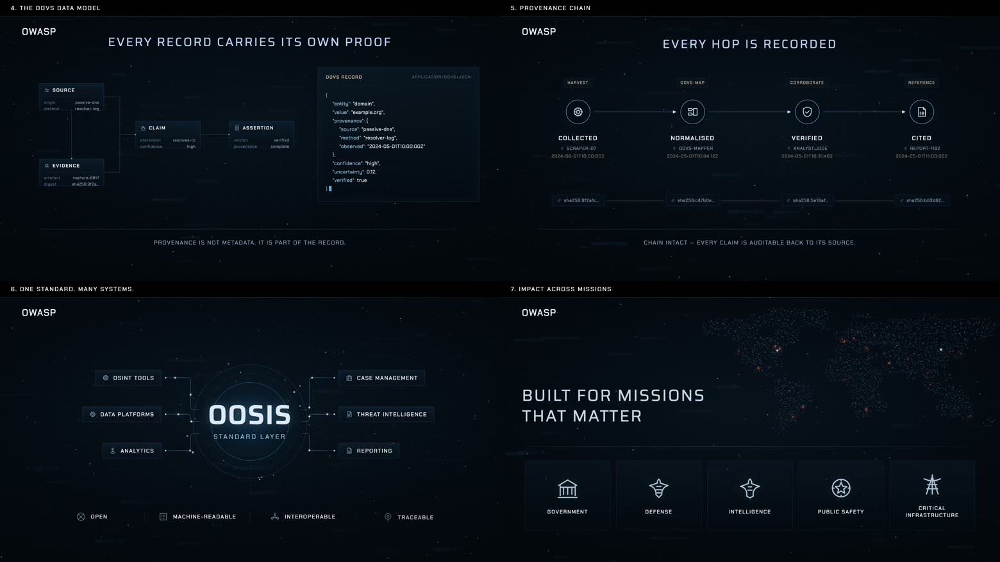
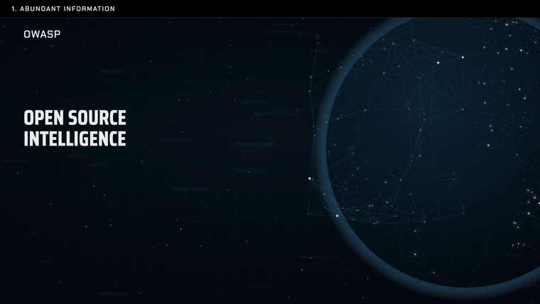

<div align="center">

<picture>
  <source media="(prefers-color-scheme: dark)" srcset="media/oovs-banner.jpg">
  <source media="(prefers-color-scheme: light)" srcset="media/oovs-banner-light.jpg">
  
</picture>

<h3>Open-source intelligence now informs decisions that affect liberty, safety, and national security.<br>OOVS is an open standard that makes those decisions defensible.</h3>

<p><i>Every judgment traceable to its origin · every requirement testable against published criteria · AI output never mistaken for evidence</i></p>

<p>
<a href="https://github.com/OWASP/OWASP-Open-Source-Intelligence-Standard/releases/latest"></a>
<a href="https://github.com/OWASP/OWASP-Open-Source-Intelligence-Standard/actions/workflows/validate-structured-assets.yml"></a>
<a href="oovs/v0.1/requirements.json"></a>
<a href="oovs/v0.1/tests.json"></a>
</p>

<p>
<a href="https://www.owasp.community/projects/open-source-intelligence-standard"></a>
<a href="LICENSE"></a>
<a href="https://owasp.org/OWASP-Open-Source-Intelligence-Standard/"></a>
<a href="#validate-the-repository"></a>
</p>

**[Read the standard](oovs/v0.1/standard.md)**  ·  **[The ten requirements](https://owasp.org/OWASP-Open-Source-Intelligence-Standard/requirements.html)**  ·  **[For evaluators](https://owasp.org/OWASP-Open-Source-Intelligence-Standard/adoption.html)**  ·  **[OWASP project page](https://www.owasp.community/projects/open-source-intelligence-standard)**

</div>

---

## The problem is not data. It is trust.

An intelligence product is only as good as the account you can give of it. Most open-source work
cannot answer four questions under scrutiny:

<div align="center">

|  | Question | What OOVS requires |
| :--: | --- | --- |
| **01** | Where did this come from? | Origin, time, method, and handling history travel with every item, and originals stay distinguishable from copies |
| **02** | Is it independently corroborated? | Independence counted by distinct origins, not mentions. Reposts and machine restatements of one source never become confirmation through repetition |
| **03** | Who is accountable for the judgment? | Observation, inference, assumption, and unknown stated separately. Automated output is an aid, never a witness, and a named person stays answerable |
| **04** | Does the caveat survive contact? | Confidence, limits, and handling constraints travel to the point of action, and a correction can reach everyone who received the product |

</div>

<div align="center">


<sub><b>What the standard asks of a working analyst.</b><br>
Provenance traced to origin · corroboration established independently · judgments attributed to a named person<br>
releases hashed so a recipient can check their copy · corrections that reach everyone who saw the original</sub>

</div>

---

## Start here

<table>
<tr>
<td width="33%" valign="top">

### Read it

The normative text, ten requirements with objectives, evidence, procedures, and pass criteria.

**[oovs/v0.1/standard.md](oovs/v0.1/standard.md)**

</td>
<td width="33%" valign="top">

### Automate it

Requirements and acceptance tests published as data, with JSON Schema, so tooling can consume them.

**[requirements.json](oovs/v0.1/requirements.json)** · **[tests.json](oovs/v0.1/tests.json)**

</td>
<td width="33%" valign="top">

### Record a result

A portable assessment format, with a worked synthetic example you can copy.

**[assessment.schema.json](oovs/v0.1/assessment.schema.json)** · **[example](oovs/v0.1/examples/synthetic-assessment.json)**

</td>
</tr>
</table>

Also worth reading: the [release notes](releases/v0.1.0/README.md), the
[safety, rights, and misuse policy](docs/safety-rights-and-misuse-policy.md),
[governance](GOVERNANCE.md), and [how OOVS sits against prior art](docs/prior-art-and-positioning.md).

---

## The ten requirements of OOVS v0.1.0

Each requirement states an obligation, the evidence that demonstrates it, how an assessor tests it,
and what counts as failure. None depends on a particular tool, vendor, or platform.

<div align="center">

| ID | Requirement |
| --- | --- |
| `OOVS-v0.1.0-01` | Authorised purpose and proportionality |
| `OOVS-v0.1.0-02` | Collection boundary and data minimisation |
| `OOVS-v0.1.0-03` | Source provenance and integrity |
| `OOVS-v0.1.0-04` | Source and claim assessment |
| `OOVS-v0.1.0-05` | Corroboration and confidence |
| `OOVS-v0.1.0-06` | Analytic transparency and reproducibility |
| `OOVS-v0.1.0-07` | Rights, privacy, and safeguarding |
| `OOVS-v0.1.0-08` | AI and automation assurance |
| `OOVS-v0.1.0-09` | Dissemination and action controls |
| `OOVS-v0.1.0-10` | Governance, audit, and improvement |

</div>

Cite a requirement by its identifier, for example `OWASP OOVS v0.1.0, OOVS-v0.1.0-04`. The
[plain-language walkthrough](https://owasp.org/OWASP-Open-Source-Intelligence-Standard/requirements.html)
explains each one without the normative wording.

---

## How it holds together

<div align="center">



</div>

<table>
<tr>
<td width="50%" valign="top">

**Every record carries its own proof.** A source, a claim, an assertion, and the evidence behind
it travel together, with confidence and uncertainty stated rather than implied.

</td>
<td width="50%" valign="top">

**Every hop is recorded.** Collected, normalised, verified, cited — each step carries a hash, so a
claim stays auditable back to its origin.

</td>
</tr>
<tr>
<td width="50%" valign="top">

**One standard, many systems.** OOVS describes a layer between the tools that gather and the
systems that decide, rather than another platform to adopt.

</td>
<td width="50%" valign="top">

**Built for work that gets questioned.** Government, defence, intelligence, public safety, and
critical infrastructure, where a decision has to survive review.

</td>
</tr>
</table>

---

## What OOVS v0.1.0 gives you

| Capability | How it is delivered |
| --- | --- |
| A testable assurance baseline | Ten L1 requirements with objectives, evidence, procedures, and pass criteria |
| Two clear assessment targets | A defined workflow or a defined intelligence product |
| Portable results | JSON Schema for assessment output, plus a worked synthetic example |
| Automatable adoption | Requirements, tests, and schemas published as data, not only prose |
| Verification discipline | Source-origin checks so repeated reporting is not mistaken for independent corroboration |
| Rights-aware controls | Purpose, minimisation, provenance, safeguarding, AI accountability, dissemination, and correction |
| Interoperability grounding | Conservative mappings to established public guidance |

<details>
<summary><b>The wider programme, and what is available now</b></summary>

<br>

The OWASP Open Source Intelligence Standard (OOSIS) is the programme. OOVS is its normative core.

| Asset | Available now | Purpose |
| --- | --- | --- |
| **OOVS** | v0.1.0 released | Normative verification requirements, tests, and assessment format |
| **OIG** | 0.1 preview schema and synthetic graph | Minimal graph model for provenance-preserving exchange |
| **OTTM** | 0.1 preview schema and first technique record | Structured technique and tool-capability vocabulary |
| **OOTG** | Scenario template | Practitioner testing scenarios with safe fixtures |
| Top 10, packs, benchmarks, landscape, translations, reference flow | Published method and design notes | Roadmap items built on OOVS implementation evidence |

The [roadmap](docs/roadmap.md) sequences the next release: a reproducible synthetic
cyber-exposure/CTI vertical slice built on OOVS.

</details>

<details>
<summary><b>Scope, and what this standard deliberately is not</b></summary>

<br>

OOVS assesses a defined workflow or product against published requirements. Within that scope it is
designed to be used immediately by security teams, investigators, journalists, NGOs, researchers,
and public-interest organisations.

Like other voluntary standards, OOVS is **not** a certification or accreditation scheme, does
**not** determine legal compliance or evidentiary admissibility, and does **not** imply endorsement
by any government, agency, court, or vendor.

It complements rather than replaces existing guidance:

| Prior art | Relationship |
| --- | --- |
| [Berkeley Protocol](https://humanrights.berkeley.edu/publications/berkeley-protocol-on-digital-open-source-investigations/) | International professional and ethical standards for digital open-source investigation |
| [ICD 203](https://www.dni.gov/files/documents/ICD/ICD-203.pdf) / [ICD 206](https://www.dni.gov/files/documents/ICD/ICD-206.pdf) | Analytic standards and sourcing requirements |
| [W3C PROV](https://www.w3.org/TR/prov-overview/) | Provenance data model |
| [STIX/TAXII](https://www.oasis-open.org/standard/stix-version-2-1/) | Threat intelligence representation and exchange |
| [CASE/UCO](https://caseontology.org/) | Cyber-investigation ontology |

OOVS is a standard, not an intelligence platform such as OpenCTI, MISP, or Aleph.

</details>

---

## Validate the repository

Every claim this repository makes about itself is checkable with one command.

```sh
python3 -m venv .venv
source .venv/bin/activate
python3 -m pip install -r requirements-validation.txt
python3 scripts/validate_assets.py
```

Validation covers JSON Schema conformance, cross-file semantics, Markdown/JSON requirement parity,
positive and expected-failure fixtures, local documentation links, and release-manifest file hashes.
The same command runs in [CI](.github/workflows/validate-structured-assets.yml) on every push.

---

## Project leadership

<table>
<tr>
<td valign="middle">

**Manish Tripathy** — Project leader

</td>
<td valign="middle">

<a href="mailto:manish.tripathy@owasp.org"></a>
<a href="https://github.com/usualdork"></a>

</td>
</tr>
</table>

The authoritative leader record is the
[OWASP project page](https://www.owasp.community/projects/open-source-intelligence-standard). Open
review roles are listed in [MAINTAINERS.md](MAINTAINERS.md), and the project actively wants
reviewers from different organisations, regions, and legal contexts.

## Contributing

Read [CONTRIBUTING.md](CONTRIBUTING.md), [GOVERNANCE.md](GOVERNANCE.md), and the
[Code of Conduct](CODE_OF_CONDUCT.md). Implementation results, assessor feedback, technique records,
mappings, translations, and reviews are all welcome.

Use synthetic, consented, anonymised, or non-sensitive public examples. Do not submit personal data,
live-case material, victim information, target lists, credentials, or harmful operational detail.

## License

Copyright © 2026 OWASP Foundation and contributors.

Unless a file states otherwise, documentation and structured standard content in this repository are
licensed under the [Creative Commons Attribution-ShareAlike 4.0 International License](LICENSE)
(CC BY-SA 4.0). You may share and adapt the material, including commercially, provided you give
appropriate credit, link to the license, indicate changes, and license your contributions under the
same terms.

---

## Overview video

Sixty seconds on why verification is the constraint, the data model that carries proof with every
record, and the provenance chain that keeps a claim auditable back to its source.

<div align="center">



<b><a href="media/oovs-overview.mp4">▶ Watch the full overview</a></b>

</div>

<div align="center">
<br>
<sub>OWASP and the OWASP logo are registered trademarks of the OWASP Foundation, Inc.<br>
Incubator stage means the Foundation hosts this project; it is not a review or an endorsement of the content.</sub>
</div>
