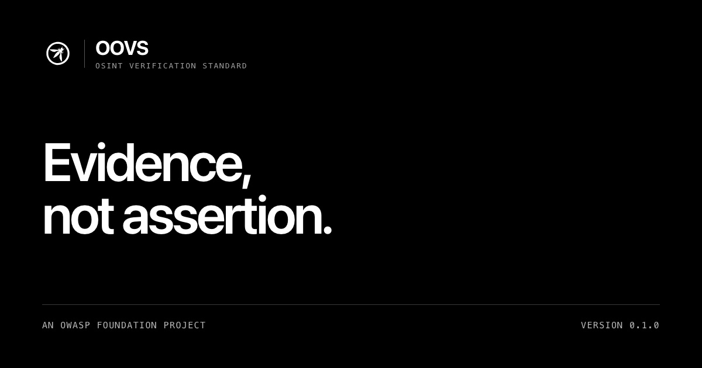
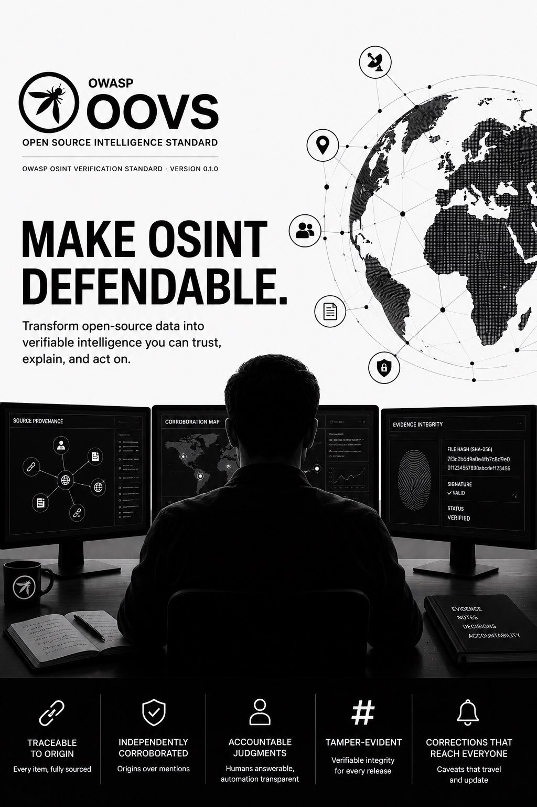

<div align="center">



<br>

**Open-source intelligence now informs decisions that affect liberty, safety, and national security.**<br>
OOVS is an open standard that makes those decisions defensible.

<br>

[](https://github.com/OWASP/OWASP-Open-Source-Intelligence-Standard/releases/latest)
[](https://github.com/OWASP/OWASP-Open-Source-Intelligence-Standard/actions/workflows/validate-structured-assets.yml)
[](oovs/v0.1/requirements.json)
[](oovs/v0.1/tests.json)
[](https://www.owasp.community/projects/open-source-intelligence-standard)
[](LICENSE)

**[Read the standard](oovs/v0.1/standard.md)** · **[The ten requirements](https://owasp.org/OWASP-Open-Source-Intelligence-Standard/requirements.html)** · **[For evaluators](https://owasp.org/OWASP-Open-Source-Intelligence-Standard/adoption.html)** · **[OWASP project page](https://www.owasp.community/projects/open-source-intelligence-standard)**

</div>

---

## Why this exists

An intelligence product is only as good as the account you can give of it. Most open-source
work cannot answer four questions under scrutiny: where did this come from, who decided it was
credible, would another analyst reach the same conclusion, and has the record changed since.

OOVS answers them by construction. It states ten requirements, binds exactly one acceptance
test to each, publishes both as data rather than only prose, and fingerprints every release so
the text you assessed against can be shown to be the text that was published.

<div align="center">

https://github.com/OWASP/OWASP-Open-Source-Intelligence-Standard/raw/main/media/oovs-overview.mp4

<sub>If the player does not load, [download the overview video](media/oovs-overview.mp4) (MP4, 1080p, 67s).</sub>

</div>

## Start here

- Read the [OOVS v0.1.0 standard](oovs/v0.1/standard.md).
- Use the [machine-readable requirements](oovs/v0.1/requirements.json) and [acceptance tests](oovs/v0.1/tests.json) in your own tooling.
- Record results with the [assessment schema](oovs/v0.1/assessment.schema.json) and [worked example](oovs/v0.1/examples/synthetic-assessment.json).
- Review the [release notes](releases/v0.1.0/README.md), [safety policy](docs/safety-rights-and-misuse-policy.md), [governance](GOVERNANCE.md), and [prior-art positioning](docs/prior-art-and-positioning.md).

## The ten requirements of OOVS v0.1.0

Each requirement states an obligation, the evidence that demonstrates it, how an assessor tests
it, and what counts as failure. None depends on a particular tool, vendor, or platform.

| ID | Requirement |
| --- | --- |
| `OOVS-v0.1.0-01` | Authorised purpose and proportionality |
| `OOVS-v0.1.0-02` | Collection boundary and data minimisation |
| `OOVS-v0.1.0-03` | Source provenance and integrity |
| `OOVS-v0.1.0-04` | Source and claim assessment |
| `OOVS-v0.1.0-05` | Corroboration and confidence |
| `OOVS-v0.1.0-06` | Analytic transparency and reproducibility |
| `OOVS-v0.1.0-07` | Rights, privacy, and safeguarding |
| `OOVS-v0.1.0-08` | AI and automation assurance |
| `OOVS-v0.1.0-09` | Dissemination and action controls |
| `OOVS-v0.1.0-10` | Governance, audit, and improvement |

The [plain-language walkthrough](https://owasp.org/OWASP-Open-Source-Intelligence-Standard/requirements.html)
explains each one without the normative language.

<div align="center">



</div>

## What OOVS v0.1.0 gives you

| Capability | How it is delivered |
| --- | --- |
| A testable assurance baseline | Ten L1 requirements with objectives, evidence, procedures, and pass criteria |
| Two clear assessment targets | A defined workflow or a defined intelligence product |
| Portable results | JSON Schema for assessment output, plus a worked synthetic example |
| Automatable adoption | Requirements, tests, and schemas published as data, not only prose |
| Verification discipline | Source-origin checks so repeated reporting is not mistaken for independent corroboration |
| Rights-aware controls | Purpose, minimisation, provenance, safeguarding, AI accountability, dissemination, and correction |
| Interoperability grounding | Conservative mappings to established public guidance |

<details>
<summary><b>Programme assets and what is available now</b></summary>

<br>

The OWASP Open Source Intelligence Standard (OOSIS) is the programme. OOVS is its normative core.

| Asset | Available now | Purpose |
| --- | --- | --- |
| **OOVS** | v0.1.0 released | Normative verification requirements, tests, and assessment format |
| **OIG** | 0.1 preview schema and synthetic graph | Minimal graph model for provenance-preserving exchange |
| **OTTM** | 0.1 preview schema and first technique record | Structured technique and tool-capability vocabulary |
| **OOTG** | Scenario template | Practitioner testing scenarios with safe fixtures |
| Top 10, packs, benchmarks, landscape, translations, reference flow | Published method and design notes | Roadmap items built on OOVS implementation evidence |

The [roadmap](docs/roadmap.md) sequences the next release: a reproducible synthetic
cyber-exposure/CTI vertical slice built on OOVS.

</details>

## Scope of the standard

OOVS assesses a defined workflow or product against published requirements. Within that scope it
is designed to be used immediately by security teams, investigators, journalists, NGOs,
researchers, and public-interest organisations.

Like other voluntary standards, OOVS is not a certification or accreditation scheme, does not
determine legal compliance or evidentiary admissibility, and does not imply endorsement by any
government, agency, court, or vendor. It complements the
[Berkeley Protocol](https://humanrights.berkeley.edu/publications/berkeley-protocol-on-digital-open-source-investigations/),
[ICD 203](https://www.dni.gov/files/documents/ICD/ICD-203.pdf)/[206](https://www.dni.gov/files/documents/ICD/ICD-206.pdf),
[W3C PROV](https://www.w3.org/TR/prov-overview/),
[STIX/TAXII](https://www.oasis-open.org/standard/stix-version-2-1/), and
[CASE/UCO](https://caseontology.org/), and it is a standard rather than an intelligence platform
such as OpenCTI, MISP, or Aleph.

## Validate the repository

Every claim this repository makes about itself is checkable with one command. Python 3.10 or
newer is recommended.

```sh
python3 -m venv .venv
source .venv/bin/activate
python3 -m pip install -r requirements-validation.txt
python3 scripts/validate_assets.py
```

Validation covers JSON Schema conformance, cross-file semantics, Markdown/JSON requirement
parity, positive and expected-failure fixtures, local documentation links, and release-manifest
file hashes. The same command runs in [CI](.github/workflows/validate-structured-assets.yml) on
every push.

## Project leadership

| Role | Person | Contact |
| --- | --- | --- |
| Project leader | Manish Tripathy | [manish.tripathy@owasp.org](mailto:manish.tripathy@owasp.org) · [github.com/usualdork](https://github.com/usualdork) |

The authoritative leader record is the
[OWASP project page](https://www.owasp.community/projects/open-source-intelligence-standard).
Open review roles are listed in [MAINTAINERS.md](MAINTAINERS.md), and the project actively wants
reviewers from different organisations, regions, and legal contexts.

## Contributing

Read [CONTRIBUTING.md](CONTRIBUTING.md), [GOVERNANCE.md](GOVERNANCE.md), and the
[Code of Conduct](CODE_OF_CONDUCT.md). Implementation results, assessor feedback, technique
records, mappings, translations, and reviews are all welcome.

Use synthetic, consented, anonymised, or non-sensitive public examples. Do not submit personal
data, live-case material, victim information, target lists, credentials, or harmful operational
detail.

## License

Copyright © 2026 OWASP Foundation and contributors.

Unless a file states otherwise, documentation and structured standard content in this repository
are licensed under the
[Creative Commons Attribution-ShareAlike 4.0 International License](LICENSE) (CC BY-SA 4.0). You
may share and adapt the material, including commercially, provided you give appropriate credit,
link to the license, indicate changes, and license your contributions under the same terms.

When citing the standard, reference the asset, version, and requirement identifier, for example
`OWASP OOVS v0.1.0, OOVS-v0.1.0-04`.

<div align="center">
<br>
<sub>OWASP and the OWASP logo are registered trademarks of the OWASP Foundation, Inc.<br>
Incubator stage means the Foundation hosts this project; it is not a review or an endorsement of the content.</sub>
</div>
